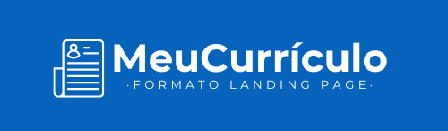
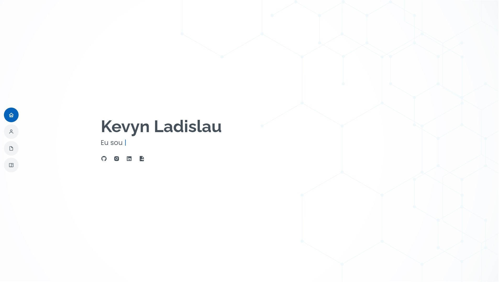

  

Projeto de um site do meu currículo em formato de LP 

  <a href="#-tecnologias">Tecnologias</a>&nbsp;&nbsp;&nbsp;|&nbsp;&nbsp;&nbsp;
  <a href="#-projeto">Projeto</a>&nbsp;&nbsp;&nbsp;|&nbsp;&nbsp;&nbsp;
  <a href="#-preview">Preview</a>

  
  
   

 

## 🚀 Tecnologias
Esse projeto foi desenvolvido com as seguintes tecnologias:
- [HTML5](https://html.com/)
- [CSS3](https://developer.mozilla.org/pt-BR/docs/Web/CSS)
- [Javascript](https://www.javascript.com)
- [Bootstrap5](https://getbootstrap.com)
- [Boxicons](https://boxicons.com)
- [Git](https://git-scm.com)

 
 

## 📖 Projeto
Este projeto utiliza as tecnologias html5, css3, js, bootstrap5 para o desenvolvimento do layout</b>. O projeto ainda está em desenvolvimento ao percorrer da minha busca de capacitação para conquistar uma oportunidade. O projeto contém:
- [x] Home
- [x] Sobre
- [x] Resumo
- [ ] Certificado (atualizar para dados)
- [ ] Portfolio (atualizar projetos)
 
 

## 🖥 Preview

  

Veja o projeto funcionando <a href="https://kevynfirst.github.io/site-curriculo/
">aqui</a>. 👈
 

## 😉 Obrigado por visitar meu projeto

Você pode conferir outros projetos que desenvolvi aqui no meu GitHub, ou entrar em contato comigo pelos demais links.

